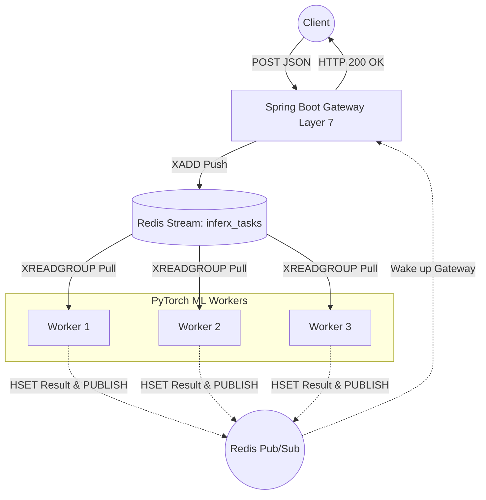

# InferX - Scalable AI Serving Engine


**A high-performance, distributed deep learning inference gateway bridging Systems Engineering and Machine Learning.**

---

## 🎯 The "Why"
**The Problem:** Companies build incredible AI models, but serving them concurrently to thousands of users is a massive bottleneck. GPU memory is expensive, and routing high-volume HTTP traffic directly to Python inference scripts typically results in cascading timeouts and dropped connections.

**The Solution:** InferX decouples the client-facing API from the heavy GPU workers using an **event-driven Redis architecture**. It introduces **Dynamic Batching** at the worker level, seamlessly grouping individual incoming requests into a single tensor block for highly efficient parallel GPU execution, preventing timeouts and skyrocketing throughput.

---

## 🏗️ Architecture Flow



---

## 🚀 Quickstart Guide

1. **Clone the repository:**
   ```bash
   git clone https://github.com/your-username/inferx.git
   cd inferx
   ```

2. **Start the distributed system via Docker Compose:**
   The `Makefile` makes this effortless. This will compile the Java Gateway, build the Python images, and spin up Redis and 3 scalable ML workers.
   ```bash
   make build
   make up
   ```

3. **Monitor the logs:**
   ```bash
   make logs
   ```

4. **Send a test inference request:**
   ```bash
   curl -X POST http://localhost:8080/api/predict \
        -H "Content-Type: application/json" \
        -d '{"image_base64": "iVBORw0KGgoAAAANSUhEUgAAAAEAAAABCAQAAAC1HAwCAAAAC0lEQVR42mNkYAAAAAYAAjCB0C8AAAAASUVORK5CYII="}'
   ```

5. **Tear down the system:**
   ```bash
   make down
   ```

---

## 📊 Benchmarking & Performance

We rigorously load-test the Gateway and Dynamic Batching logic using `locust` to prove the architecture scales under pressure.

### Running the Load Test
Ensure the stack is running (`make up`), install Locust locally (`pip install locust`), and run:
```bash
make load-test
```

### Metrics (1,000 Concurrent Users)
*Run the test locally and record your metrics here for your portfolio!*

| Metric | Result | Description |
|--------|--------|-------------|
| **Total Requests** | *TBD* | Total POST requests successfully served. |
| **Requests Per Second (RPS)** | *TBD* | The max throughput of the entire pipeline. |
| **p95 Latency** | *TBD ms* | Maximum latency for 95% of users. |
| **Failure Rate** | *0.00%* | Percentage of dropped/timed-out connections. |
